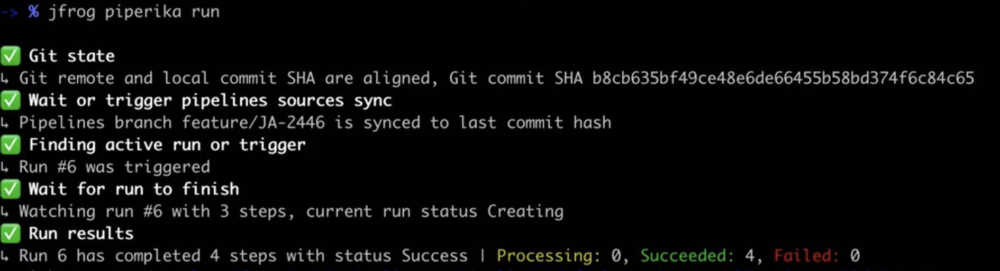
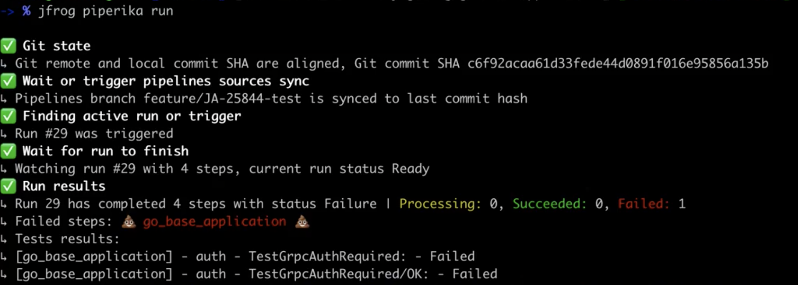
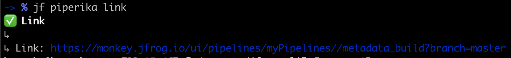

## About this plugin
This is a JFrog Pipelines CLI utility with an emphasis on the consumer experience.</br>
As a consumer of CI/CD system, you don't always want to understand the complexity but just "use" it.</br></br>
Piperika provides a single command that does all the complex work for you.</br>
All you need to do is to commit and push your code, and launch Piperika. It will start the CI on your branch, follow the build process and show you all the relevant data including your progress. 

### What will Piperika do?
* Validate that your local commit is on the remote git server (so the CI server could reach it)
* Sync Pipelines with your branch and latest commit SHA (if needed).
* Check if there is a CI pipe that is already running with your commit, if not, it will trigger it.
* Follow up your CI run, providing the current state and progress, information about your run steps (in progress, succeed and failed steps), and displays information about tests failure.

## Installation with JFrog CLI
Installing the latest version:

`$ jf plugin install piperika`

Installing a specific version:

`$ jf plugin install piperika@version`

Uninstalling a plugin

`$ jf plugin uninstall piperika`

## Building from source
To build the **Piperika** binary
```shell
$ make build
```

To build the **Piperika** binary for multiple operating systems and architectures (Mac, Linux and Windows)
```shell
$ make build-multi-os
```

To install the plugin to the JFrog CLI
```shell
$ make install
```

## Usage
### Configuration
JFrog Pipelines ONLY accepts Access Tokens for authentication and authorization.</br>
If you set your JFrog CLI with Username/Password, you will need to create a new profile that uses an identity token: 
1. Create an identity token via [Artifactory UI](https://www.jfrog.com/confluence/display/JFROG/User+Profile#UserProfile-IdentityTokenidentitytoken). </br>
2. Create a new [JFrog CLI profile](https://jfrog.com/knowledge-base/how-to-configure-jfrog-cli-to-work-with-artifactory-video/), and when asked for Access Token, use the generated identity token above.</br>
You can also create a new JFrog CLI profile via command line:
```shell
$ jf c add pipr-profile --url='https://myarti.com' --interactive=false --access-token='your-identity-token'
$ jf c use pipr-profile
```

### Commands
#### Build
```shell
$ jf piperika build # or just 'jf piperika b'
```

It will: 
1. Validate that your git branch is ready to run.
2. Trigger a run if needed.
3. Attach to the Pipelines run and show you the progress.
</br></br>

Output example for a successful Pipelines run:



Output example for a Pipelines run that had a unit test failure:



#### Link
```shell
$ jf piperika link # or just 'jf piperika l'
```
Give you quick access to your Pipelines pipe.
It will provide you with a direct link to your specific Pipelines build.



## Release Notes
The release notes are available [here](RELEASE.md).

## Owners
Hanoch Giner</br>
Itai Raz</br>
Omer Karjevsky